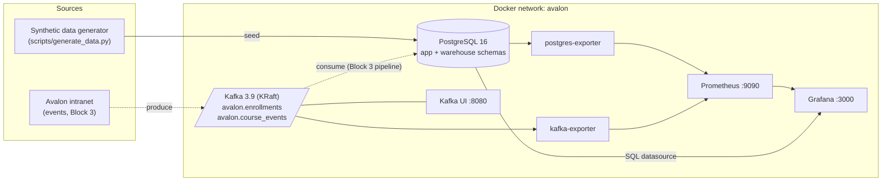
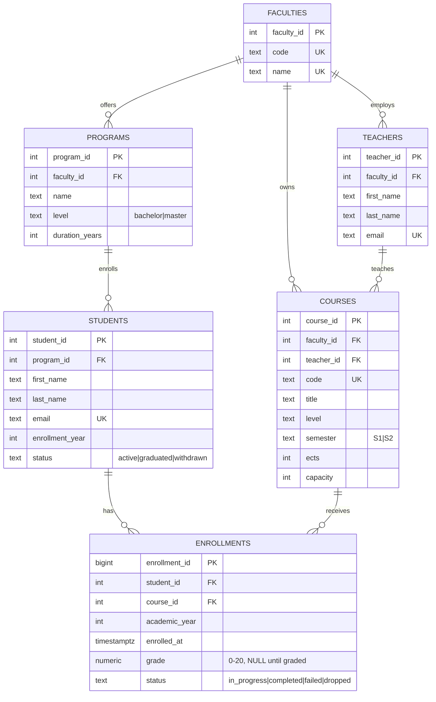
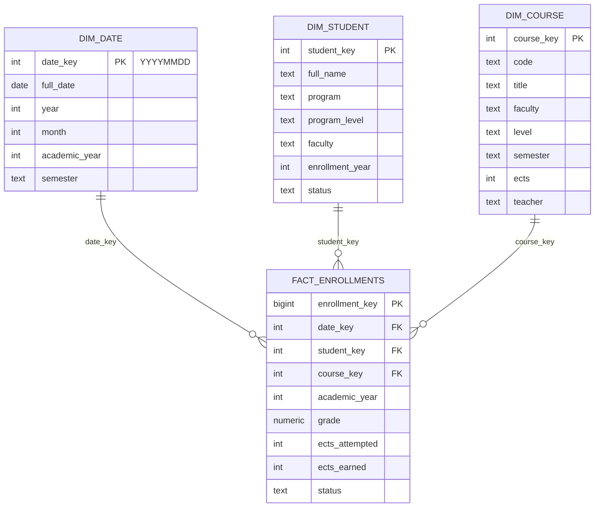

# Avalon University — Data Platform Architecture

Self-hosted data infrastructure for Avalon University (fictional public university, Paris).
It underpins three deliverables: this infrastructure (Block 2), the real-time pipeline
(Block 3) and the course-recommendation ML service (Block 4).

## Design decisions

| Decision | Choice | Why |
|---|---|---|
| Hosting | Self-hosted, Docker | Reproducible anywhere, no cloud billing, aligns with the GDPR/data-sovereignty posture of the governance plan (Block 1) |
| Warehouse | PostgreSQL 16 (dedicated `warehouse` schema) | dbt-compatible, free, swappable for a cloud warehouse without changing the architecture |
| Streaming | Apache Kafka 3.9, KRaft mode | Industry standard; no ZooKeeper; single broker is enough at this scale |
| IaC | Terraform (Docker provider) + Docker Compose | Compose for fast local loops, Terraform as the reviewable IaC definition |
| Monitoring | Prometheus + exporters + Grafana | Standard pull-based observability; one dashboard provisioned as code |

## Component view

Dashed arrows are Block 3 flows: the foundation provisions the broker and topics,
the pipeline code lives in the Block 3 repository.

## Operational data model (ERD, `app` schema)

## Analytical model (star schema, `warehouse` schema)

Grain of the fact table: **one row per student × course × academic year**.
Typical questions it answers: ECTS earned per faculty per year, failure rates by
course, enrollment volume per semester — and it is the training source for the
Block 4 course recommender.

The warehouse is loaded by `scripts/load_warehouse.sql` (full reload, idempotent).
In Block 3 this hand-written ELT is replaced by an orchestrated dbt project; the
schemas stay the same.

## Network & ports

| Service | Container | Host port |
|---|---|---|
| PostgreSQL | avalon-postgres | 5432 |
| Kafka (EXTERNAL listener) | avalon-kafka | 9094 |
| Kafka UI | avalon-kafka-ui | 8080 |
| Prometheus | avalon-prometheus | 9090 |
| Grafana | avalon-grafana | 3000 |

Exporters (postgres-exporter :9187, kafka-exporter :9308) are reachable only on the
internal `avalon` network — they have no published host ports.
